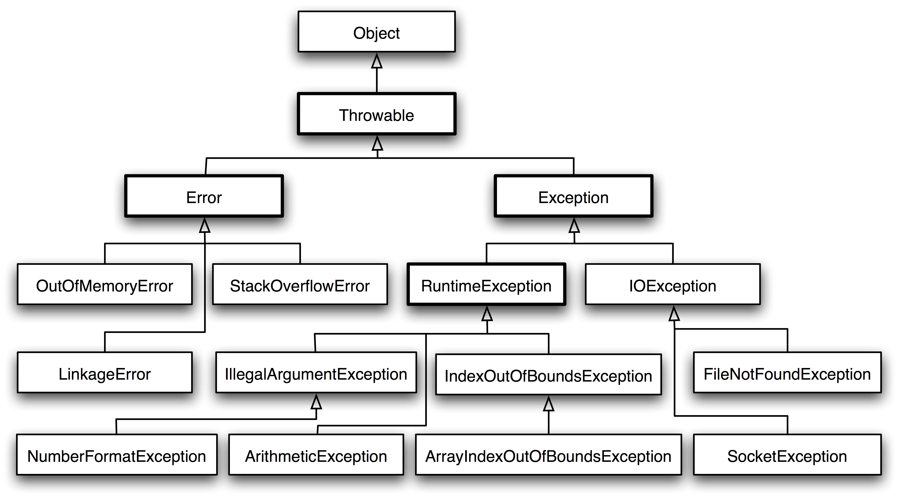

# java 基础

[Interview-notebook java基础](https://github.com/CyC2018/Interview-Notebook/blob/master/notes/Java%20%E5%9F%BA%E7%A1%80.md)

## 1.牛客网

1. [java 存根(stub)的作用：动态加载](https://www.nowcoder.com/questionTerminal/8b992ee9de5e40bb84f6fd29e69d842d?orderByHotValue=1&difficulty=11000&mutiTagIds=607_640&page=1&onlyReference=false)  

2. [Hibernate延迟加载的机制](https://blog.csdn.net/zhushuai1221/article/details/51737062)

> 1.当调用session上的load()加载一个实体时，会采用延迟加载。
2.当session加载某个实体时，会对这个实体中的集合属性值采用延迟加载
3.当session加载某个实体时，会对这个实体所有单端关联的另一个实体对象采用延迟加载。

3. equals 和"=="的区别

> 对于基本类型，没有equals函数，直接使用==来判断
对于引用类型，==判断两个实例是否引用同一个对象，equals()判断引用的对象是否等价。

4. 等价关系

自反性、对称性、传递性、一致性、非null性

## 2. Object的几个方法：

- 1. equals()方法的实现

> 检查是否为同一个对象的引用，如果是直接返回 true；
> 检查是否是同一个类型，如果不是，直接返回 false；
> 将 Object 实例进行转型；
> 判断每个关键域是否相等。

- 2. hashcode()

该方法返回散列值, equals()返回true的对象实例的hashcode()一定相同，反之不一定。

- 3. toString()
该方法返回类名@hashcode16进制b表示

- 4. clone()
该方法是Object类的一个protected方法，如果不显示覆盖也不实现Clonable接口的话，调用该方法就会抛出异常`java.lang.CloneNotSupportedException`  

- 5. 深拷贝与浅拷贝：

> 浅拷贝：拷贝实例和原始实例的引用类型引用同一个对象
> 深拷贝：拷贝实例和原始实例的引用类型引用不同对象

note: 使用 clone() 方法来拷贝一个对象即复杂又有风险，它会抛出异常，并且还需要类型转换。Effective Java 书上讲到，最好不要去使用 clone()，可以使用拷贝构造函数或者拷贝工厂来拷贝一个对象。

## 3. 继承

访问权限:
- private: 类访问权限，限于类内部访问
- protected: 继承访问权限，子类可见，通常修饰成员变量，对类没有意义
- 默认: 包级访问权限，同一个包内可见
- public: 公开访问权限，全部可见

使用权限控制是为了对模块进行封装，不过多暴露类的设计细节。

如果子类的方法覆盖了父类的方法，那么子类中该方法的访问级别不允许低于父类的访问级别。这是为了确保可以使用父类实例的地方都可以使用子类实例，也就是确保满足里氏替换原则。

抽象类与接口：

抽象类和抽象方法都使用 abstract 进行声明。抽象类一般会包含抽象方法，抽象方法一定位于抽象类中。
抽象类和普通类最大的区别是，抽象类不能被实例化，需要继承抽象类才能实例化其子类。

接口是抽象类的延伸，在 Java 8 之前，它可以看成是一个完全抽象的类，也就是说它不能有任何的方法实现。
从 Java 8 开始，接口也可以拥有默认的方法实现，这是因为不支持默认方法的接口的维护成本太高了。在 Java 8
之前，如果一个接口想要添加新的方法，那么要修改所有实现了该接口的类。

接口的成员（字段 + 方法）默认都是 public 的，并且不允许定义为 private 或者 protected。
接口的字段默认都是 static 和 final 的。

抽象类和接口的比较
  |    | 抽象类 | 接口
  --- | ---| ---
  设计| IS-A, 满足里式替换原则| LIKE-A, 提供一个方法实现契约
  使用| 单继承| 多实现
  字段| 无限制| static or final
  方法| 无限制| public

如何使用：

使用抽象类：

需要在几个相关的类中共享代码。
需要能控制继承来的方法和域的访问权限，而不是都为 public。
需要继承非静态（non-static）和非常量（non-final）字段。

使用接口：

需要让不相关的类都实现一个方法，例如不相关的类都可以实现 Compareable 接口中的 compareTo() 方法；
需要使用多重继承，例如Runnable接口实现线程类

## Super:

- 访问父类的构造函数：可以使用 super() 函数访问父类的构造函数，从而完成一些初始化的工作。
- 访问父类的成员：如果子类覆盖了父类的中某个方法的实现，可以通过使用 super 关键字来引用父类的方法实现。

## String

| | 是否可变| 是否线程安全
---| ---| ---
String | 否 | 是
StringBuffer | 是 | 是（内部通过synchronized来同步）
StringBuilder | 是 | 否

String 不可变的原因：
- 可以缓存hash值
- 常量池需要
- 线程安全

使用 String.intern() 可以保证相同内容的字符串实例引用相同的内存对象。

## 基本类型的封装类型
自动拆装箱，直接使用赋值

boolean/1
byte/8
char/16
short/16
int/32
float/32
long/64
double/64

## 反射机制

Class 类和java.lang.reflect类库

Field ：可以使用 get() 和 set() 方法读取和修改 Field 对象关联的字段；
Method ：可以使用 invoke() 方法调用与 Method 对象关联的方法；
Constructor ：可以用 Constructor 创建新的对象。

通过java的反射机制也可以创建对象，操作类或者对象的内部属性。

用法：
1.在运行时判断任意一个对象所属的类；
2.在运行时构造任意一个类的对象；
3.在运行时判断任意一个类所具有的成员变量和方法（通过反射甚至可以调用private方法）；
4.在运行时调用任意一个对象的方法

## Synchronized 和 volitate区别

[volatile与synchronized的区别](https://www.cnblogs.com/tf-Y/p/5266710.html)

1) volatile本质是在告诉jvm当前变量在寄存器中的值是不确定的,需要从主存中读取,synchronized则是锁定当前变量,只有当前线程可以访问该变量,其他线程被阻塞住.
2) volatile仅能使用在变量级别,synchronized则可以使用在变量,方法.
3) volatile仅能实现变量的修改可见性,而synchronized则可以保证变量的修改可见性和原子性.
　　《Java编程思想》上说，定义long或double变量时，如果使用volatile关键字，就会获得（简单的赋值与返回操作）原子性
4) volatile不会造成线程的阻塞,而synchronized可能会造成线程的阻塞.
5) 当一个域的值依赖于它之前的值时，volatile就无法工作了，如n=n+1,n++等。如果某个域的值受到其他域的值的限制，那么volatile也无法工作，如Range类的lower和upper边界，必须遵循lower<=upper的限制。
6) 使用volatile而不是synchronized的唯一安全的情况是类中只有一个可变的域。

## 异常

Throwable 可以用来表示任何可以作为异常抛出的类，分为两种： Error 和 Exception。其中 Error 用来表示 JVM 无法处理的错误，Exception 分为两种：

受检异常 ：需要用 try...catch... 语句捕获并进行处理，并且可以从异常中恢复；
非受检异常 ：是程序运行时错误，例如除 0 会引发 Arithmetic Exception，此时程序奔溃并且无法恢复。
  

[java入门之异常处理](https://www.tianmaying.com/tutorial/Java-Exception)

## 泛型

[java 泛型详解](http://www.importnew.com/24029.html)

## 注解

Java 注解是附加在代码中的一些元信息，用于一些工具在编译、运行时进行解析和使用，起到说明、配置的功能。注解不会也不能影响代码的实际逻辑，仅仅起到辅助性的作用。

[注解 Annotation 实现原理与自定义注解例子](https://www.cnblogs.com/acm-bingzi/p/javaAnnotation.html)

注解利用了java的反射机制来实现对对象的动态配置

## 面向对象

[封装、继承、多态 三大特性](https://github.com/CyC2018/Interview-Notebook/blob/master/notes/%E9%9D%A2%E5%90%91%E5%AF%B9%E8%B1%A1%E6%80%9D%E6%83%B3.md#%E5%B0%81%E8%A3%85%E7%BB%A7%E6%89%BF%E5%A4%9A%E6%80%81)

[面向对象编程三大特性------封装、继承、多态](https://blog.csdn.net/jianyuerensheng/article/details/51602015)

### 封装

尽可能的隐藏类的设计细节，只保留部分对外开放的接口，有利于减少模块间的耦合，减轻维护负担，有效调节性能，提高软件的重用性，降低构建大型系统的风险（整体不可用，部分模块可用）

### 继承

继承应该遵循里氏替换原则，子类对象必须能够替换掉所有父类对象。

当超类对象引用变量引用子类对象时，被引用对象的类型而不是引用变量的类型决定了调用谁的成员方法，但是这个被调用的方法必须是在超类中定义过的，也就是说被子类覆盖的方法。（但是如果强制把超类转换成子类的话，就可以调用子类中新添加而超类没有的方法了。）

在继承链中对象方法的调用存在一个优先级：this.show(O)、super.show(O)、this.show((super)O)、super.show((super)O)。

### 多态

多态分为编译时多态和运行时多态。编译时多态主要指方法的重载，运行时多态指程序中定义的对象引用所指向的具体类型在运行期间才确定。

运行时多态有三个条件：

- 继承
- 覆盖（重写）
- 向上转型（父类引用指向子类对象）

## 设计原则

S.O.L.I.D 原则  
|简写 |	全拼	| 中文翻译 | 简述
--- | --- | --- | ---
SRP|	The Single Responsibility Principle |	单一责任原则 | 一个类制作一件事，解耦合 
OCP|	The Open Closed Principle	 | 开放封闭原则 | 添加新功能的时候，不需要修改代码，典型的就是装饰者模式 
LSP|	The Liskov Substitution Principle	|里氏替换原则 | 子类能够当成父类用，需要比父类更加特殊 
ISP|	The Interface Segregation Principle	|接口分离原则 | 不强迫客户实现不需要用的接口，即接口功能上的分离 
DIP|	The Dependency Inversion Principle | 依赖倒置原则 | 高层模块不应该依赖于低层模块，二者都应该依赖于抽象；抽象不应该依赖于细节，细节应该依赖于抽象。

## 类图

[看懂UML类图](http://design-patterns.readthedocs.io/zh_CN/latest/read_uml.html#generalization)

